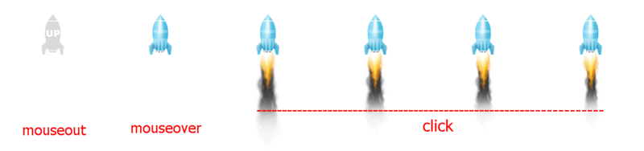

##如何使用  
1. 在头部包含 <code>jquery.rocketUp.min.js</code> jquery插件，当然jquery代码是必须先包含进来的  
2. 将图片rocket_up.png加入你的文件夹中，默认是在images文件夹下，也可以修改成自己想要的路径，先不急，下面会说到  

###标准配置调用  
	$(function () {
		$.rocketUp();
	});  

###自定义配置调用  
	$(function () {
    	$.rocketUp({
        	rocketName:"rocketUp",  //元素ID
        	UpSpeed:600,            //滚动条回顶速度(ms)
        	rocketShow:100,         //回顶图标显示临界高度
        	top:"70%",              //回顶图标所在位置
        	right:"0",              //同上
        	rocketSpeed:400,        //火箭回顶速度(ms)
        	background:"url(images/rocket_up.png)no-repeat" //图标路径路径
    	});
	});  

###效果  

  